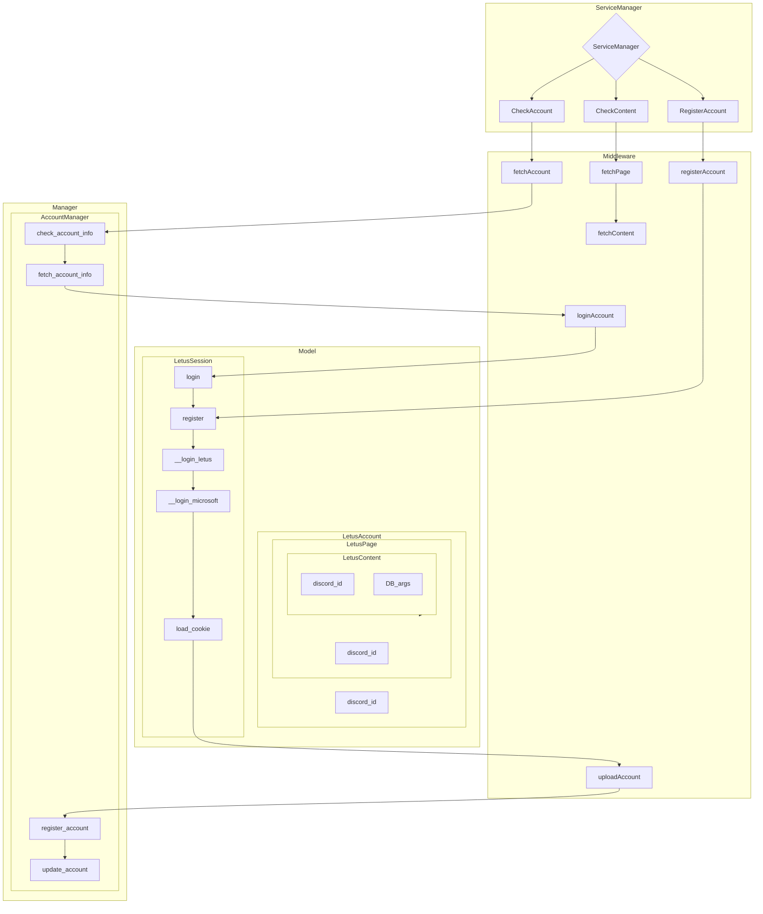

# letus-scraper

```bash
/home/otkrickey/dev/letus-scraper/.venv/bin/python /home/otkrickey/dev/letus-scraper/main.py -l info -e 1
/home/otkrickey/dev/letus-scraper/.venv/bin/python /home/otkrickey/dev/letus-scraper/main.py -s checkAccount -d 601235188571176961 -l info -e 1098772108579962950:1099020068198809610
```

## TODO

### Task on MongoDB

- default

  - Discord: (user_id, guild_id, category_id, channel_id, message_id)

- Account

  - Register Account
    - TUS: (student_id, encrypted_password)
  - Update Account Info
    - TUS: (student_id, encrypted_password)
  - Unregister Account
    - TUS: (student_id, encrypted_password)
  - Check Account Info
    - TUS: (student_id)

- Page
  - Register Page
    - LETUS: (page_id)
    - TUS: (student_id) # Optional: If not provided, use the student_id from the account
  - Fetch Page
    - LETUS: (page_id)
    - TUS: (student_id) # Optional: If not provided, use the student_id from the account
  - Unregister Page
    - LETUS: (page_id)
    - TUS: (student_id) # Optional: If not provided, use the student_id from the account

### Flow



```


```
